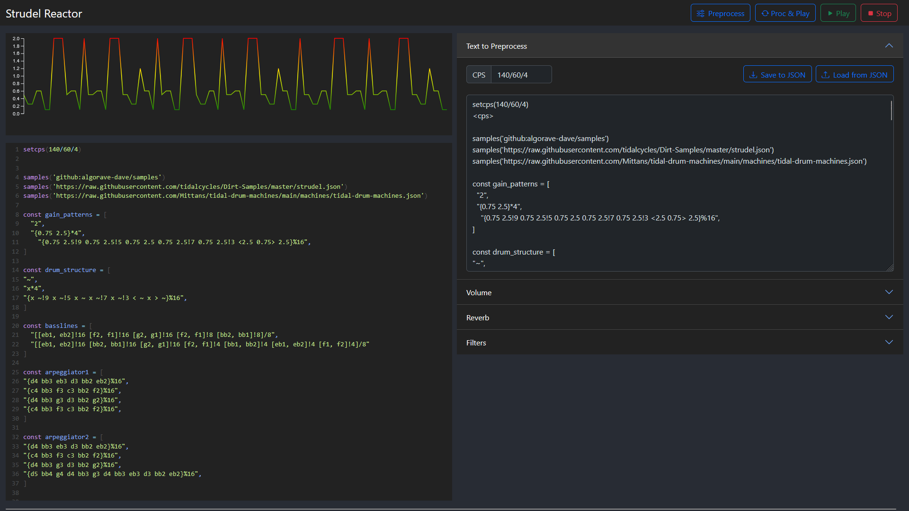
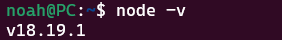
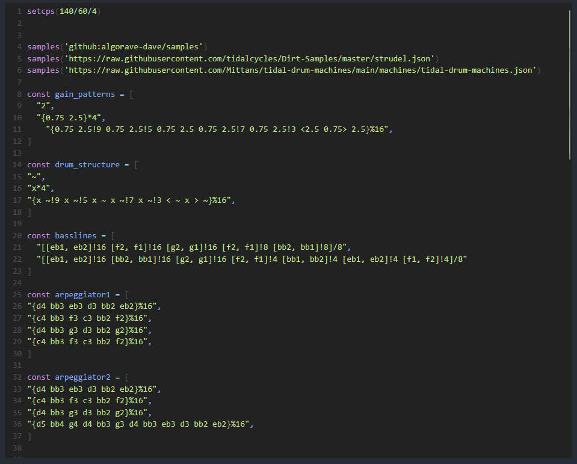
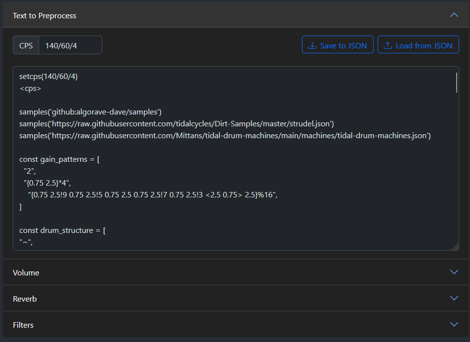
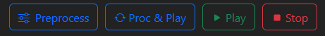
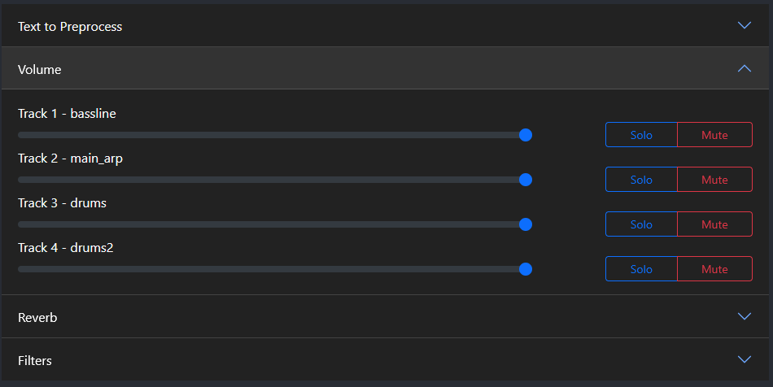
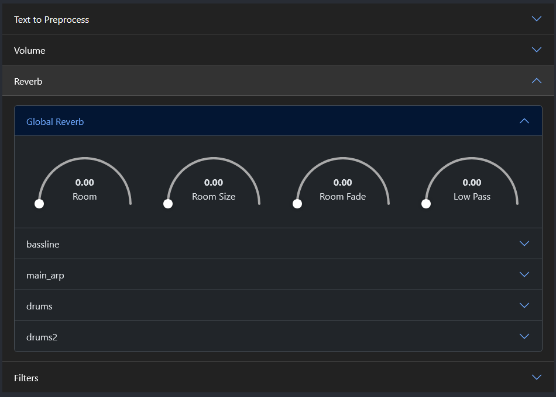
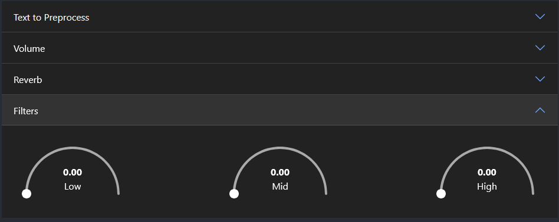
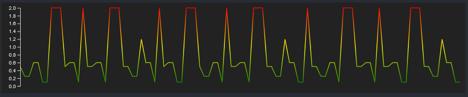

# Strudel Reactor

## About the Project

<div align='center'>
    
</div>

\<insert a description of Strudel Reactor here>

### Built With

 &nbsp;


## Getting Started

### Prerequisites

Before you can setup the application to run, there are a few required pieces of software that will need to be installed on your system. These are:

1. [Node.JS v18+](#nodejs)
2. [npm](#npm)

#### Node.JS

To install Node.JS, head over the the [Node.JS](https://nodejs.org/en/download) website and install the latest LTS version available.

After following the installation guide, check that it has successfully installed by running the following command in the Terminal:

```
node -v
```

You should see a response similar to the following image if it has successfully installed.



#### Node Package Manager (NPM)

It is suggested that you install the latest version on the Node Package Manager (npm) before attempting to run this application.

To install the latest version, type the following into your Terminal:

```
npm install npm@latest -g
```

## Usage

### Running the Application

To start running the application, enter the following command:

```
npm start
```

Upon load, you will be greated with the interface.

### Features

**Strudel Editor**

The Strudel Editor panel provides the interface for all processed Strudel code, which will be run upon the PLAY button getting clicked.

<div align="center">
    
</div>

**Text to Preprocess Editor**

Within the text area, shown in the image below, you can enter valid Strudel code to be loaded into the Strudel Editor panel. It is suggested that this area is used to enter all new music, and can be used to enter "tags" to utilise the provided controllers.

Within Strudel Reactor, there are five categories of tags that can be used - CPS, Volume, Mute, Reverb, and Filter.

<div align='center'>

|          Tag          | Category |                                   Description                                   |
| :-------------------: | :------: | :-----------------------------------------------------------------------------: |
|  <_TrackName_\_Mute>  |   Mute   |   Mutes the specified track (replace 'TrackName' with the actual track name).   |
| <_TrackName_\_Volume> |  Volume  |                  Adjusts the postgain of the track specified.                   |
|    <global_reverb>    |  Reverb  | Adjusts the global reverb properties (see [Reverb Controls](#reverb-controls)). |
| <_TrackName_\_reverb> |  Reverb  |                Adjusts the specified track's reverb properties.                 |
|   <global_low_pass>   |  Filter  |          Adjusts the Low Pass Frequency range through applying .lpf().          |
|  <global_band_pass>   |  Filter  |       Adjusts the Band/Mid Pass Frequency range through applying .bpf().        |
|  <global_high_pass>   |  Filter  |         Adjusts the High Pass Frequency range through applying .hpf().          |

</div>
<br>
<div align="center">
    
</div>

**Play and Processing Controls**

The play and processing controls do exactly as the button states,

1. Preprocess the text in Text to Preprocess,
2. Process the text in Text to Preprocess and then play it,
3. Play the track in the Strudel Editor, and
4. Stop the track in the Strudel Editor.

<div align="center">
    
</div>

**Volume Controls**

The volume controls are dymanically loaded in based on the pattern labels (also known as tracks). A pattern label takes the form of "`track_name:`" and contains three seperate controls per track. These controls are:

-   the volume slider,
-   the Solo button, and
-   the Mute/Unmute button.

The volume slider works in the same way many sliders do, by running in steps from 0% to 100%. In case, 0% equals 0 postgain, and 100% equals 1 postgain, with a step of 0.1.

The Mute/Unmute button provides the user with an interface which allows them to silence any given track with just the click of a button (plus Preprocess/Proc&Play).

The Solo button takes the mute button to the next level. Taking inspiration from popular Digital Audio Workstations (DAWs), like Ableton Live and FL Studio, allows the user to signal out a singular tracks audio, resulting in the other tracks being muted. Upon _'soloing'_ a track, the user will be able to unmute other instruments as they please so they can compare, say two different drums.

<div align="center">
    
</div>

**Reverb Controls**

The reverb controls contain one constant control, as well as dynamically generated track-specific control groups. Within each control group, there are four dials associated to different reverb settings, with slight differences in functionality. It is worth noting that when the dial is revolved to 0%, the reverb setting is removed from the Strudel code upon Preprocess.

<div align='center'>

| Setting       | Minimum Value | Maximum Value | Description                                                                           |
| :------------ | :-----------: | :-----------: | :------------------------------------------------------------------------------------ |
| Room          |       0       |       1       | Simulates the acoustics of a real room.                                               |
| Room Size     |       0       |      10       | Simulates the physical dimensions of a space to create a bigger, more spacious sound. |
| Room Fade     |       0       |      20       | The fade in/out of the reverb inside the `room`.                                      |
| Room Low Pass |       0       |    20,000     | Simulates the sense of depth and distance in the reverb sound.                        |

</div>

<div align="center">
    
</div>

**Filter Controls**

The filter controls affect the audio played at a global level. This means that all tracks will be affected. Within the filter controls, there are three dials:

<div align='center'>

| Filter        | Minimum Value | Maximum Value | Description                                                                                                                        |
| :------------ | :-----------: | :-----------: | :--------------------------------------------------------------------------------------------------------------------------------- |
| Low Pass      |       0       |    20,000     | Sets cutoff frequency of the low pass filter. Low pass filters traditionally only allow frequencies below selected cutoff.         |
| Band/Mid Pass |       0       |    20,000     | Sets center frequency of the band pass filter. Band pass filters traditionally only allow frequencies between two set frequencies. |
| High Pass     |       0       |    20,000     | Sets cutoff frequency of the high pass filter. Low pass filters traditionally only allow frequencies above selected cutoff.        |

</div>

<div align="center">
    
</div>

**Set CPS**

Sets the Cycles per Second for the song, and affects all tracks equally. If you are wishing to enter a BPM value (like the default CPS for the provided track [140BPM]), you will need to use the following format:

```
[Beats per Second] / 60 [or length of "minute"] / [Beats per Cycle]
```

Some examples of converted BPMs include:

```
100 BPM == 100/60/4
140 BPM == 140/60/4
180 BPM == 180/60/4
```

<div align="center">
     <!-- Update with Highlighted Set CPS Field -->
</div>

**Visualiser**

The visualiser panel displays a D3 Line Graph reacting to the gain value obtained from Strudel's `.log()` feature. This means that the gain value being used is from all tracks being played, which helps produce a nice, varied pattern. To create the Green/Yellow/Red level effect the following transitional percentages were used:

<div align='center'>

| Colour | Percentage |
| :----: | :--------: |
| Green  |     0%     |
| Yellow |    50%     |
|  Red   |    100%    |

</div>

<div align="center">
    
</div>

**JSON Import and Export**

Within the Text to Preprocess accordian tab, it can be noticed that there are two buttons, "Save to JSON" and "Load from JSON". These buttons are used to import and export both the preprocessed Strudel code and the various control settings changed for the track.

<div align="center">
     <!-- Update with Highlighted JSON Buttons -->
</div>

## Acknowledgements

This project has utilised:

-   [React-Bootstrap](https://react-bootstrap.netlify.app/) (v3.0.0-beta.5)
-   [Bootstrap](https://getbootstrap.com/) (v5.3)
-   [Bootstrap Icons](https://icons.getbootstrap.com/) (v1.13.1)
-   [react-circular-slider-svg](https://www.npmjs.com/package/react-circular-slider-svg) (v0.4.0)

These third-party packages have been utilised throughout Strudel Reactor to prove the user wit hthe best visual experience that we can provide. Prior to adding these third-party packages to the project, checks were conducted to ensure that they met expectations and were a definitive requirement for the system.
